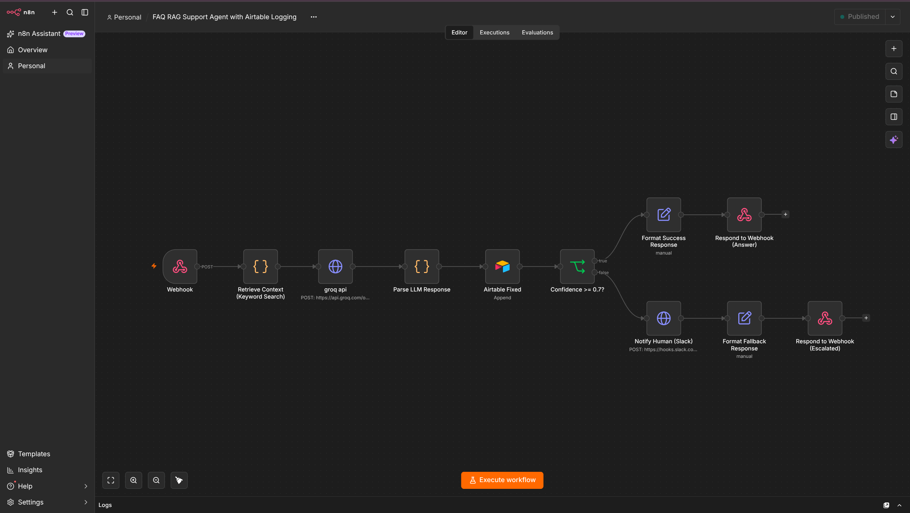
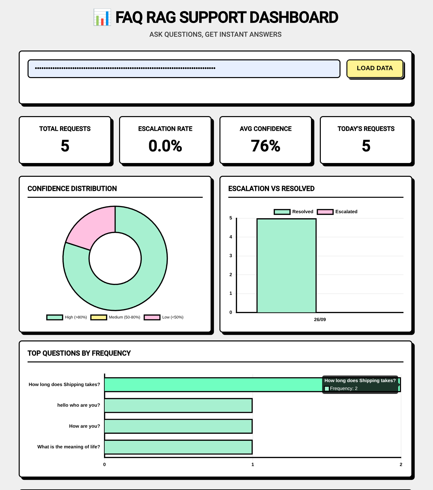

# FAQ RAG Support Agent

An AI-powered customer support assistant that handles FAQs, escalates complex queries to human agents via Slack, and logs interactions to Airtable.

## Architecture & Workflow



## Dashboard

*(Dashboard image will be added here)*
<!--  -->

## Deployment

### 1. n8n Setup
1. Import the `n8n workflow/FAQ RAG Support Agent.json` file into your n8n instance.
2. Update the placeholders in the workflow with your real credentials:
   - **Slack Webhook Node**: Replace `https://hooks.slack.com/services/YOUR/SLACK/WEBHOOK` with your actual Slack webhook URL.
   - **Airtable Node**: Replace `YOUR_AIRTABLE_BASE_ID` and `YOUR_AIRTABLE_TABLE_ID` with your actual base and table IDs. Update credentials.
   - **Groq Node**: Add your Groq API credentials.

### 2. Frontend Configuration & Vercel Deployment

Since the frontend is built with vanilla HTML/JS, environment variables set in Vercel are not automatically injected into the frontend `app.js`. You have two options:

**Option A (Static/Direct Replacement):**
Before pushing to GitHub or deploying, update the placeholders at the top of `frontend/app.js` with your actual values:
- `AIRTABLE_BASE_ID`
- `AIRTABLE_TABLE_ID`
- `N8N_WEBHOOK_URL`
- `N8N_API_KEY`

**Option B (Vercel Serverless Functions):**
If you want to keep your API keys hidden from the browser, you can create a Vercel Serverless Function (e.g., in an `api/` folder) to handle requests to n8n and Airtable, and put your keys in Vercel's Environment Variables:
- `VITE_AIRTABLE_BASE_ID` (if using a bundler like Vite)
- `VITE_N8N_WEBHOOK_URL`
- etc.

### Vercel Environment Variables
If you upgrade this to use a backend or a framework (like Next.js or Vite) on Vercel, or set up serverless functions, you will need to add the following variables to your Vercel project settings (`Project Settings > Environment Variables`):

- `AIRTABLE_BASE_ID`: Your Airtable Base ID.
- `AIRTABLE_TABLE_ID`: Your Airtable Table ID.
- `N8N_WEBHOOK_URL`: Your n8n webhook URL.
- `N8N_API_KEY`: Your n8n webhook authentication key (if configured).

### 3. Deploying to Vercel
1. Push this repository to GitHub.
2. Go to [Vercel](https://vercel.com/) and create a new project.
3. Import your GitHub repository.
4. Set the **Framework Preset** to `Other`.
5. Set the **Root Directory** to `frontend`.
6. Click **Deploy**.

## Repository Setup
This project has been initialized with Git and is ready to be pushed to your GitHub repository.

```bash
git remote add origin https://github.com/yourusername/your-repo-name.git
git branch -M main
git push -u origin main
```
